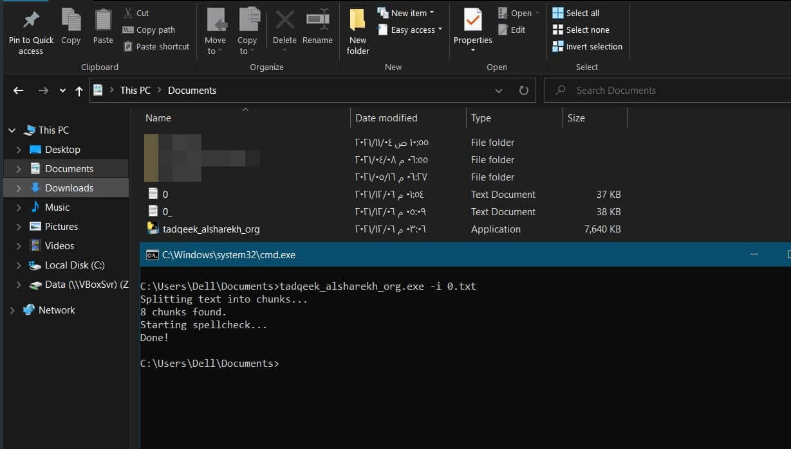

# tadqeek_sakhr
A mini command line tool to spellcheck text files using [tadqeek.alsharekh.org](https://tadqeek.alsharekh.org)

[](https://github.com/yshalsager/tadqeek_sakhr/releases/)

[](https://github.com/ellerbrock/open-source-badges/)
[](https://www.python.org/)

[](https://www.paypal.me/yshalsager)
[](https://www.patreon.com/XiaomiFirmwareUpdater)
[](https://liberapay.com/yshalsager)


## Usage

```bash
usage: python tadqeek_sakhr.py [-h] -i INPUT [-o OUTPUT]

optional arguments:
  -h, --help            show this help message and exit
  -i INPUT, --input INPUT
                        Path of text file to be checked.
  -o OUTPUT, --output OUTPUT
                        Path of output file.

```




# أداة سطر أوامر مدقق صخر

أداة صغيرة لتدقيق الملفات النصية عبر [مدقق صخر](https://tadqeek.alsharekh.org).

## الاستخدام
- حمل أحدث نسخة من الملف التنفيذي للأداة من [هنا](https://github.com/yshalsager/tadqeek_sakhr/releases/latest).
- قم بتشغيل الملف التنفيذي عبر سطر/موجه اﻷوامر مع استبدال كلمة filename باسم الملف المراد تدقيقه.

```powershell
./tadqeek_sakhr.exe -i filename
```